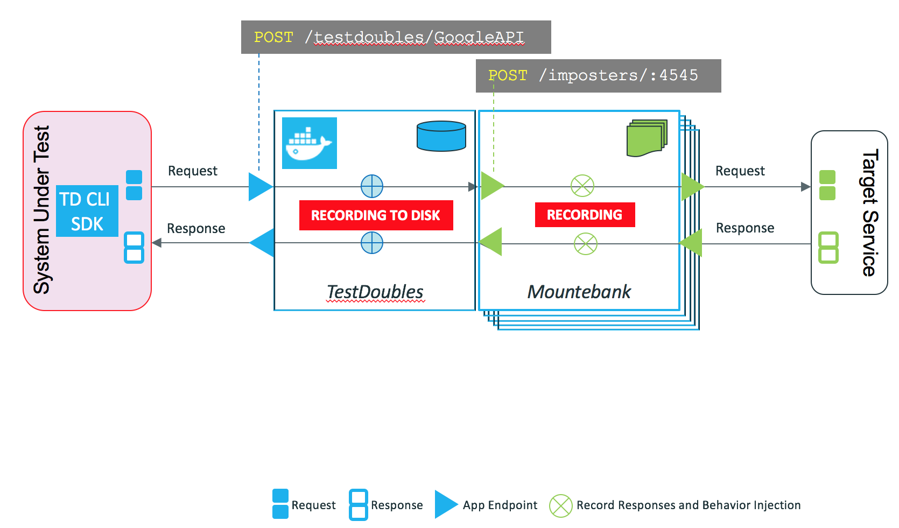

# TestDoubles - Light Weight Service Virtualization for iPaaS and Microservices #

## Introduction ##

TestDoubles is a ["Test Double"](https://en.wikipedia.org/wiki/Test_double) framework that mimics a service by acting as an intermediate agent between a client and the actual service. It can also act as a proxy and record the interactions between the client and the service. Once these interactions are recorded, they can be replayed to mimic the behavior of the actual service. Each service that is made by the tester or client is considered to be a test double. TestDoubles is intended to treat the middleware integration platforms such as MuleSoft, Oracle, Boomi, Informatica, JitterBit, SnapLogic and others as the "System Under Test", bringing the concept of Continuous Testing to the EAI world. The high level approach is described below.

Please refer to the [documentation](documentation/index.md) for more details
